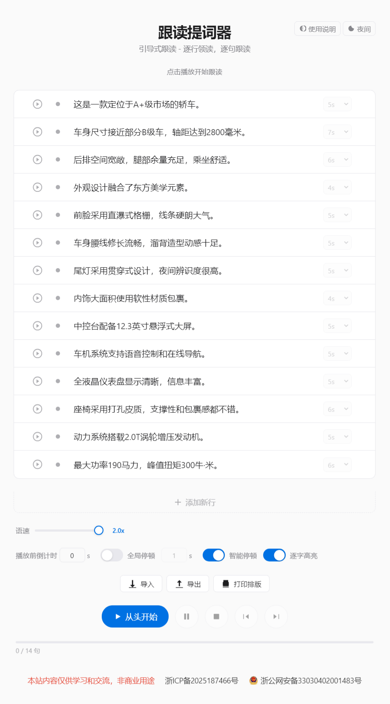

# 跟读提词器

一个简洁的引导式跟读提词器，适合演讲、朗诵、外语跟读、无纸化对话、主持、口播、视障辅助阅读等场景。

## 功能特点

- **逐行领读**：系统逐句朗读，每句之间留出跟读时间。
- **逐字高亮**：朗读时当前字高亮显示，像卡拉 OK 一样跟随节奏。
- **灵活停顿**：支持全局固定停顿、智能按字数计算停顿，或逐行自定义停顿。
- **语速调节**：0.5x ~ 2.0x 多档语速可调。
- **可拖拽调整排序**：按住每行左侧把手，可自由拖动调整句子顺序。
- **文稿导入/导出**：支持 .txt 文本导入和导出，方便备份和编辑。
- **打印排版**：一键优化打印布局，便于纸质排练。
- **夜间模式**：一键切换深色主题，保护眼睛。
- **移动端适配**：针对手机浏览器做了触控和布局优化。

## 使用场景

- **演讲与朗诵排练**：提前把稿子按句录入，跟随系统领读练习节奏和停顿。
- **外语跟读训练**：利用逐字高亮和语速调节，模仿发音。
- **无纸化对话拍摄**：搭配超小型蓝牙耳机使用，将台词按句输入，系统逐句领读，完成无纸质台词的对话录制或直播，避免忘词和低头看稿。
- **舞台主持提词**：手机打开页面放在手边，跟随语音提示上台发言。
- **短视频/直播口播**：将脚本拆成短句，按自己的节奏逐句跟读，提升口播流畅度。
- **客服/销售话术演练**：把标准话术录入，反复跟读训练，巩固话术。
- **诗歌/台词背诵**：通过听一句、跟一句的方式，加深对长篇内容的记忆。
- **视障辅助朗读**：配合语音合成，让文字内容以语音形式逐句呈现，辅助阅读。

## 使用方法

1. 用浏览器打开 `index.html`。
2. 在输入框中填入要练习的文稿，每行一句话。
3. 点击"从头开始"，系统会领读一句，然后给出停顿时间供你朗读。
4. 使用"上一句"/"下一句"跳转，或按空格键暂停/继续。

## 文件说明

| 文件 | 说明 |
|------|------|
| `index.html` | 页面结构与入口 |
| `styles.css` | 样式与响应式布局 |
| `app.js` | 应用状态、播放控制、导入导出逻辑 |
| `ui.js` | 界面渲染、Toast、倒计时覆盖层 |
| `tts.js` | 浏览器语音合成（TTS）封装 |
| `storage.js` | LocalStorage 持久化、文本导入导出工具 |

## 技术栈

- 纯 HTML / CSS / JavaScript
- 浏览器原生 Web Speech API 语音合成
- LocalStorage 本地数据持久化

## 浏览器兼容性

推荐使用 Chrome、Edge、Safari 等现代浏览器。语音合成功能依赖浏览器对 Web Speech API 的支持。

## 截图

